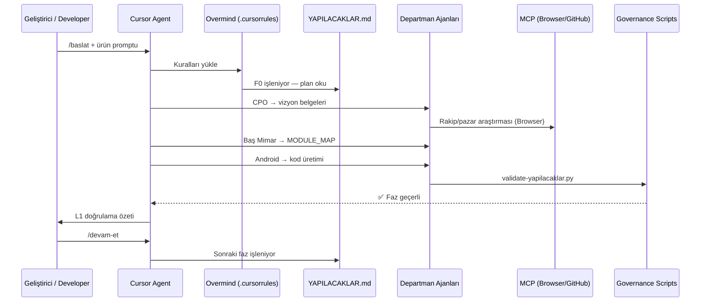
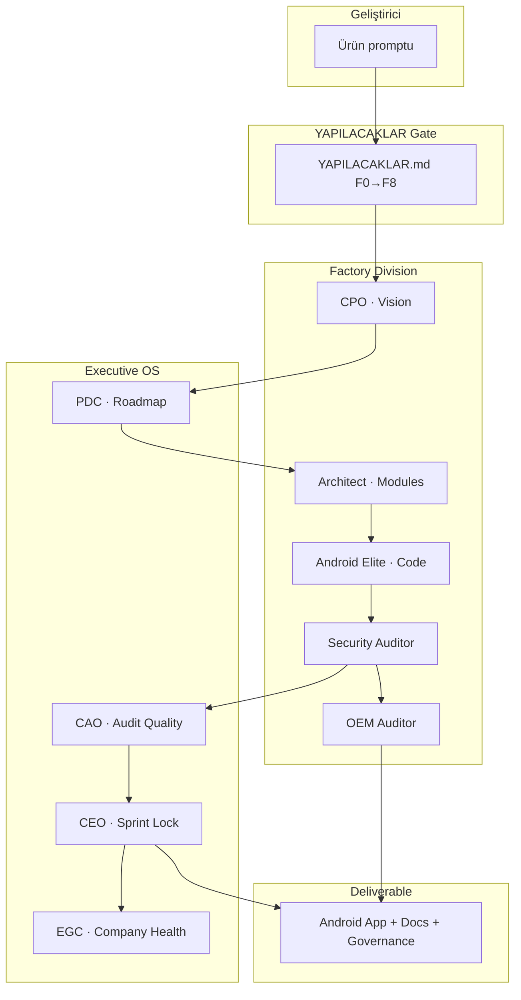

<div align="center">

# Ulas Autonomous Android APP Factory

**Cursor-native Android üretim sistemi · Tek kaynak, ölçülebilir kalite, tekrarlanabilir teslimat**

<br>

[](.factory/meta.json)
[](LICENSE)
[](docs/FACTORY_SCORECARD.md)
[](https://github.com/clariongemini/Android-App/actions/workflows/validate.yml)

<br>

[](docs/33-LAYER-ARCHITECTURE.md)
[](docs/EXECUTIVE_OS.md)
[](AGENTS.md)
[](docs/02-ARCHITECTURE/ANDROID_STRUCTURE.md)
[](docs/MCP_SETUP.md)

<br>

**[GitHub](https://github.com/clariongemini/Android-App)** ·
**[Bootstrap](docs/BOOTSTRAP.md)** ·
**[Executive OS](docs/EXECUTIVE_OS.md)** ·
**[Ajanlar](AGENTS.md)** ·
**[Yazar](docs/AUTHOR.md)**

</div>

---

<table>
<tr>
<td width="50%" valign="top">

<h3 align="left">Türkçe</h3>

<p><strong>Ulas Autonomous Android APP Factory</strong>, Android uygulamalarını her seferinde aynı mühendislik disipliniyle üretmek için tasarlanmış <strong>GitHub template fabrika reposudur</strong>.</p>

<p>Bu depo bir APK değildir. <strong>Standartlar, governance, Gradle şablonu ve Cursor ajan kuralları</strong> burada yaşar; uygulama kodu <code>init-new-app.sh</code> veya <code>sync-standards.sh</code> ile hedef projeye aktarılır.</p>

<p>
<strong>Yazar</strong> · <a href="docs/AUTHOR.md">Ulaş Kaşıkcı</a><br>
<strong>Lisans</strong> · <a href="LICENSE">MIT</a><br>
<strong>Sürüm</strong> · v1.0.0<br>
<strong>Ortam</strong> · Cursor IDE + Agent Mode
</p>

<p><strong>Ne sağlar?</strong></p>
<ul>
<li><strong>YAPILACAKLAR (F0–F8)</strong> — Plan onaylanmadan kod üretilmez.</li>
<li><strong>16 departman ajanı</strong> — CPO, Baş Mimar, Android, güvenlik, OEM, Executive OS.</li>
<li><strong>33 katman</strong> — 360 bileşenlik denetim çerçevesi.</li>
<li><strong>10 modüllü iskelet</strong> — Compose, Clean Architecture, billing, FCM, güvenlik.</li>
<li><strong>Halüsinasyon sıfır</strong> — CI, pre-commit ve audit scriptleri zorunlu.</li>
</ul>

<p><strong>Hızlı başlangıç:</strong> Template → <code>./scripts/first-setup.sh</code> → Cursor'da <code>/baslat</code></p>

</td>
<td width="50%" valign="top">

<h3 align="left">English</h3>

<p><strong>Ulas Autonomous Android APP Factory</strong> is a <strong>GitHub template factory repository</strong> built to ship Android apps under the same engineering discipline—every time.</p>

<p>This repo is not an APK. <strong>Standards, governance, the Gradle scaffold, and Cursor agent rules</strong> live here; application code is transferred via <code>init-new-app.sh</code> or <code>sync-standards.sh</code>.</p>

<p>
<strong>Author</strong> · <a href="docs/AUTHOR.md">Ulaş Kaşıkcı</a><br>
<strong>License</strong> · <a href="LICENSE">MIT</a><br>
<strong>Version</strong> · v1.0.0<br>
<strong>Runtime</strong> · Cursor IDE + Agent Mode
</p>

<p><strong>What you get</strong></p>
<ul>
<li><strong>YAPILACAKLAR (F0–F8)</strong> — No code before an approved phase plan.</li>
<li><strong>16 department agents</strong> — CPO, Chief Architect, Android, security, OEM, Executive OS.</li>
<li><strong>33 layers</strong> — 360-component governance framework.</li>
<li><strong>10-module scaffold</strong> — Compose, Clean Architecture, billing, FCM, security.</li>
<li><strong>Zero-hallucination protocol</strong> — CI, pre-commit, and audit scripts enforced.</li>
</ul>

<p><strong>Quick start:</strong> Template → <code>./scripts/first-setup.sh</code> → <code>/baslat</code> in Cursor</p>

</td>
</tr>
</table>

<div align="center">

| Kalite kapısı | Komut | Sonuç |
|:---:|:---|:---:|
| Fabrika sağlığı | `./scripts/factory-health.sh` | 100 / 100 |
| Bileşik denetim | `./scripts/factory-quality-gate.sh` | CI + pre-commit |
| Smoke denetimi | `test/run-factory-audit.sh` | 32 kontrol |

<sub>Designed and maintained by <strong><a href="docs/AUTHOR.md">Ulaş Kaşıkcı</a></strong> · Android factory template · Cursor + Executive OS</sub>

</div>

---

## İçindekiler / Table of Contents

| Türkçe | English |
|--------|---------|
| [Sistem Özeti](#sistem-özeti) | [System Overview](#system-overview-en) |
| [Ne Sunar?](#ne-sunar) | [What It Delivers](#what-it-delivers) |
| [Mimari Akış](#mimari-akış--architecture-flow) | [Architecture Flow](#mimari-akış--architecture-flow) |
| [Adım Adım Kurulum](#adım-adım-kurulum-türkçe) | [Step-by-Step Setup](#step-by-step-setup-english) |
| [Repo Haritası](#repo-haritası--repository-map) | [Repository Map](#repo-haritası--repository-map) |
| [YAPILACAKLAR F0–F8](#yapilacaklar-f0f8--yapilacaklar-phases-f0f8) | [YAPILACAKLAR Phases](#yapilacaklar-f0f8--yapilacaklar-phases-f0f8) |
| [Ajanlar & Executive OS](#ajanlar--executive-os--agents--executive-os) | [Agents & Executive OS](#ajanlar--executive-os--agents--executive-os) |
| [Android İskeleti](#android-i̇skeleti-10-modül--android-scaffold-10-modules) | [Android Scaffold](#android-i̇skeleti-10-modül--android-scaffold-10-modules) |
| [Doğrulama & Kalite](#doğrulama--kalite-kapısı--validation--quality-gate) | [Validation & Quality Gate](#doğrulama--kalite-kapısı--validation--quality-gate) |
| [Senaryolar](#kullanım-senaryoları--usage-scenarios) | [Usage Scenarios](#kullanım-senaryoları--usage-scenarios) |
| [Belge Dizini](#belge-dizini--documentation-index) | [Documentation Index](#belge-dizini--documentation-index) |
| [Neden Cursor?](#neden-cursor) | [Why Cursor?](#why-cursor-en) |
| [Cursor entegrasyonu](#cursor-entegrasyonu) | [How It Works in Cursor](#cursor-entegrasyonu) |
| [Ne kazandırır?](#ne-kazandırır) | [What You Gain](#ne-kazandırır) |

---

> **İlk kez mi bakıyorsun?** Bu repo bir APK değil; Cursor'da `/baslat` ile faz planı açılır, onaydan sonra kod üretilir. Kurulum: [Bootstrap](docs/BOOTSTRAP.md).

---

## Neden Cursor?

Fabrika Cursor Agent kurallarına göre çalışır; düz sohbet LLM'i ile aynı şey değil.

| Özellik | Genel AI sohbet | Bu fabrika (Cursor) |
|---------|-----------------|---------------------|
| Proje hafızası | Her oturum sıfırdan | `.cursorrules` + `docs/00-INDEX.md` kalıcı |
| Rol bazlı uzmanlık | Tek genel asistan | **16 departman ajanı** (CPO, Baş Mimar, Android…) |
| Halüsinasyon kontrolü | Kullanıcıya bağlı | **Zorunlu** — dosya okumadan referans yasak |
| İş akışı | Serbest sohbet | **YAPILACAKLAR F0–F8** faz kapısı |
| Denetim | Yok | **Hiyerarşik audit** — tek ajan onayı yasak |
| Gerçek dünya verisi | Sınırlı | **MCP**: Browser, GitHub, Docker |
| Komutlar | Yok | `/baslat` `/devam-et` `/denetle` `/faz-durumu` |
| Otomatik doğrulama | Yok | `pre-commit` + CI + `factory-quality-gate.sh` + `test/run-factory-audit.sh` |

**Cursor yoksa** bu repo statik dokümantasyon + Gradle şablonu. **Cursor varsa** YAPILACAKLAR, ajanlar ve denetim scriptleri devreye girer.

---

## Why Cursor? (EN) {#why-cursor-en}

Same factory; English labels in tables below. Expects Cursor Agent rules—not a generic chat session.

| Feature | Generic AI chat | This factory (Cursor) |
|---------|-----------------|------------------------|
| Project memory | Resets each session | Persistent via `.cursorrules` + `docs/00-INDEX.md` |
| Role-based expertise | One general assistant | **16 department agents** (CPO, Architect, Android…) |
| Hallucination control | User-dependent | **Mandatory** — no file references without reading |
| Workflow | Free-form chat | **YAPILACAKLAR F0–F8** phase gate |
| Audit | None | **Hierarchical audit** — single-agent approval forbidden |
| Real-world data | Limited | **MCP**: Browser, GitHub, Docker |
| Commands | None | `/baslat` `/devam-et` `/denetle` `/faz-durumu` |
| Automated validation | None | `pre-commit` + CI + `factory-quality-gate.sh` + `test/run-factory-audit.sh` |

**Without Cursor:** static docs + template. **With Cursor:** phase gates, agents, audit scripts.

---

## Cursor entegrasyonu

```mermaid
flowchart TB
    subgraph CursorIDE["Cursor IDE"]
        USER["Geliştirici"]
        CHAT["Chat + Agent Mode"]

        subgraph Rules["Always-on Rules"]
            CR[".cursorrules — Overmind"]
            R00["00-zero-hallucination.mdc"]
            R01["01–17 agent .mdc files"]
        end

        subgraph Commands["Slash Commands"]
            C1["/baslat"]
            C2["/devam-et"]
            C3["/denetle"]
            C4["/faz-durumu"]
        end

        subgraph Skills["Agent Skills"]
            S1["yapilacaklar-planner"]
            S2["yapilacaklar-executor"]
            S3["zero-hallucination"]
            S4["hierarchical-audit"]
        end

        subgraph Subagents["Subagents (L1 verify)"]
            A1["phase-verifier"]
            A2["phase-auditor"]
            A3["hallucination-guard"]
        end

        subgraph MCP["MCP Servers"]
            M1["Browser — pazar/OEM"]
            M2["GitHub — CI/PR"]
            M3["Docker — build"]
        end

        USER --> CHAT
        CHAT --> Commands
        Commands --> Skills
        Skills --> Rules
        Rules --> Subagents
        CHAT --> MCP
        Subagents --> YAP["YAPILACAKLAR.md"]
        MCP --> GOV["governance/"]
    end
```



### Cursor oturum akışı / Cursor session flow



### Kullanıcı yolculuğu / User journey

```
  GitHub Template                Cursor IDE                    Çıktı / Output
  ─────────────────              ───────────                   ──────────────

  [Use this template]  ──►  [first-setup.sh]     ──►  MCP + hooks hazır
         │                  [init-new-app.sh]    ──►  Android 10 modül + governance
         │                  [/baslat prompt]     ──►  YAPILACAKLAR F0–F8 planı
         │                  [/devam-et]          ──►  Faz faz kod + belgeler
         │                  [/denetle]           ──►  CAO/CEO audit zinciri
         └──────────────────► [quality-gate]      ──►  Play Store'a hazır temel
```

---

## Ne kazandırır?

### Cursor ile pratik farklar

| # | Sorun (fabrika olmadan) | Bu repo ile |
|---|-------------------------|-------------|
| 1 | Her projede mimari sıfırdan | 33 katman + 10 modül hazır iskelet |
| 2 | AI uydurma dosya/API üretir | Halüsinasyon sıfır protokolü + validator |
| 3 | "Şimdi ne yapayım?" belirsizliği | YAPILACAKLAR F0–F8 net yol haritası |
| 4 | Tek AI cevabına güvenmek | 16 ajan + hiyerarşik denetim |
| 5 | Samsung/MIUI'de uygulama ölür | OEM P0 matris + kod şablonu |
| 6 | Güvenlik sonradan eklenir | Security/Privacy/Pentest standartları baştan |
| 7 | i18n unutulur | Hard-coded string yasağı + locale JSON |
| 8 | Monetizasyon geç kalır | Billing 7 gün trial şablonu |
| 9 | Ölçüm yok | AID Sprint P event pipeline |
| 10 | Her app için standart yazmak | `sync-standards.sh` — tek kaynak |

### What you gain (EN)

| # | Without factory | With this repo |
|---|-----------------|----------------|
| 1 | Architecture from scratch every project | 33 layers + 10-module ready scaffold |
| 2 | AI invents files/APIs | Zero-hallucination protocol + validators |
| 3 | "What do I do next?" uncertainty | YAPILACAKLAR F0–F8 clear roadmap |
| 4 | Trusting one AI answer | 16 agents + hierarchical audit |
| 5 | App dies on Samsung/MIUI | OEM P0 matrix + code templates |
| 6 | Security bolted on later | Security/Privacy/Pentest from day one |
| 7 | i18n forgotten | No hard-coded strings + locale JSON |
| 8 | Monetization arrives late | Billing 7-day trial template |
| 9 | No measurement | AID Sprint P event pipeline |
| 10 | Rewrite standards per app | `sync-standards.sh` — single source |

### Cursor'da tipik bir gün / A typical day in Cursor

```
09:00  cursor .                          → Proje açılır, Overmind kuralları yüklenir
09:05  /baslat "Offline habit tracker…"  → YAPILACAKLAR oluşur, F0 başlar
09:30  Agent: CPO pazar analizi          → MCP Browser → .cursor/snapshots/mcp/
10:00  Agent: Baş Mimar MODULE_MAP      → 10 modül yapısı onaylanır
11:00  /devam-et                         → F3 Android iskelet doğrulanır
11:30  ./scripts/gradle-build-loop.sh    → Derleme kanıtı (LATEST.gradle.log)
14:00  Agent: Android Compose UI         → Liquid Glass tema uygulanır
14:30  ./scripts/gradle-build-loop.sh    → Hata varsa log okunur, düzeltilir
16:00  /denetle                          → CAO audit, OEM matris kontrol
17:00  ./scripts/factory-quality-gate.sh → 100/100 kalite kapısı
```

### Cursor terminal köprüsü (10/10 için)

Cursor IDE **derleme ve emülatör görmez**. Fabrika terminal script'leri ile kapatır:

| Script | Amaç |
|--------|------|
| [`scripts/gradle-build-loop.sh`](scripts/gradle-build-loop.sh) | `./gradlew assembleDebug --stacktrace` + retry + log snapshot |
| [`scripts/run-maestro.sh`](scripts/run-maestro.sh) | Maestro E2E (adb + cihaz gerekir) |
| [`.cursor/snapshots/`](.cursor/snapshots/README.md) | MCP handoff + build log kanıtı |

Detay: [`docs/CURSOR_TERMINAL_BRIDGE.md`](docs/CURSOR_TERMINAL_BRIDGE.md)

### Context budget (token optimizasyonu)

Tam `33-LAYER-MANIFEST.yaml` okuma **yasak**. Ajanlar yalnızca ihtiyaç duydukları dilimleri yükler:

| Kaynak | Amaç |
|--------|------|
| [`docs/33-LAYER-MANIFEST/layer-NN.yaml`](docs/33-LAYER-MANIFEST/README.md) | Katman başına ~20 satır dilim |
| [`governance/phase-agents.json`](governance/phase-agents.json) | F0–F8 → aktif Cursor ajanları |
| [`docs/CURSOR_CONTEXT_BUDGET.md`](docs/CURSOR_CONTEXT_BUDGET.md) | Ne zaman ne okunur |
| `python3 scripts/split-layer-manifest.py` | Dilimleri manifest'ten üret |
| [`scripts/state-recovery.sh`](scripts/state-recovery.sh) | Truncation → checkpoint + rollback |
| [`docs/STATE_RECOVERY.md`](docs/STATE_RECOVERY.md) | Durum kurtarma (truncation / yarım Gradle) |

**Gradle edit sırası (Composer):** `libs.versions.toml` → `build.gradle.kts` → `AndroidManifest.xml` → `.kt`

---

## Sistem Özeti

**Ulas Autonomous Android APP Factory**, tek bir GitHub template üzerinden aynı standartla Android uygulamaları üretmek için kurduğum fabrika reposu.

Her yeni uygulamada standartları, mimariyi, güvenlik kurallarını, OEM matrisini ve Gradle iskeletini sıfırdan yazmak zorunda kalmazsın. Fabrika:

1. **Karar verir** — Ürün, pazar, roadmap (CPO, PDC, Mavi Okyanus)
2. **Tasarlar** — 33 katmanlı mimari, modül haritası (Baş Mimar)
3. **İnşa eder** — Jetpack Compose, Clean Architecture, 10 modül (Android Elite)
4. **Denetler** — Güvenlik, OEM, hiyerarşik onay zinciri (CAO, CEO, EGC)
5. **Ölçer** — Analytics Sprint P, gerçek kullanıcı verisi (AID)

Tüm süreç **halüsinasyon sıfır** protokolü ve **YAPILACAKLAR.md** faz kapısı ile yönetilir: AI, plan onaylanmadan ve aktif faz tamamlanmadan rastgele kod üretmez.

> **Fabrika ≠ Uygulama.** Bu repoda uygulama kodu yaşamaz; `templates/android/project/` altındaki iskelet, `init-new-app.sh` ile hedef projeye kopyalanır.

---

## System Overview (EN) {#system-overview-en}

**Ulas Autonomous Android APP Factory** is a GitHub template for building Android apps with the same standards, Cursor agent rules, and governance on every project.

You do not rewrite architecture, security, OEM notes, or Gradle scaffolds for each new app. The factory:

1. **Decides** — Product, market, roadmap (CPO, PDC, Blue Ocean)
2. **Designs** — 33-layer architecture, module map (Chief Architect)
3. **Builds** — Jetpack Compose, Clean Architecture, 10 modules (Android Elite)
4. **Audits** — Security, OEM, hierarchical approval chain (CAO, CEO, EGC)
5. **Measures** — Analytics Sprint P, live user data (AID)

The entire flow is governed by a **zero-hallucination protocol** and the **YAPILACAKLAR.md** phase gate: AI does not generate random code before the plan is approved and the active phase is complete.

> **Factory ≠ Application.** Application code does not live in this repo; the scaffold under `templates/android/project/` is copied to your target project via `init-new-app.sh`.

---

## Ne Sunar? / What It Delivers

| Bileşen / Component | Ne işe yarar? / Purpose | Nasıl davranır? / Behavior |
|---------------------|-------------------------|---------------------------|
| **The Overmind** (`.cursorrules`) | Merkezi koordinasyon | Tüm ajanları yönlendirir; YAPILACAKLAR okumadan kod yasak |
| **16 AI Ajanı** (`.cursor/rules/`) | Uzmanlaşmış departmanlar | Her ajan belirli katmanlardan sorumlu; tek başına nihai onay veremez |
| **Executive OS** (`governance/`) | CEO V7, sprint lock, denetim | Karar → teslimat → ölçüm zinciri; runtime dosyalar proje bazlı üretilir |
| **YAPILACAKLAR** (`YAPILACAKLAR.md`) | F0–F8 faz planı | Aynı anda tek faz `işleniyor`; L1 doğrulama zorunlu |
| **33 Katman** (`docs/33-LAYER-ARCHITECTURE.md`) | Sistem anayasası | 360 bileşen manifest ile otomatik denetlenir |
| **13 Standart** (`docs/03-STANDARDS/`) | Liquid Glass, i18n, Security… | Kod ve belge üretiminde referans; ihlal = süreç durur |
| **Android İskeleti** (`templates/android/project/`) | 10 Gradle modülü | Hilt, Room, Billing, FCM, OEM, Compose tema hazır |
| **MCP** (Browser + GitHub P0) | Gerçek dünya yetenekleri | Pazar araştırması, CI/PR, dokümantasyon doğrulama |
| **Doğrulama Scriptleri** (`scripts/`) | Otomatik kalite kapısı | `factory-quality-gate.sh` → hedef 100/100 |

---

## Mimari Akış / Architecture Flow



---

## Adım Adım Kurulum (Türkçe)

### Ön koşullar

| Gereksinim | Açıklama |
|------------|----------|
| [Cursor](https://cursor.com) | AI ajan kuralları ve MCP için |
| Git | Template klonlama ve sürüm kontrolü |
| JDK 17+ | Scaffold sonrası `./gradlew assembleDebug` için |
| Android Studio | İsteğe bağlı; Gradle sync ve emülatör |

---

### Adım 1 — Template reposunu oluştur

1. [github.com/clariongemini/Android-App](https://github.com/clariongemini/Android-App) adresine git
2. **Use this template** → **Create a new repository**
3. Yeni repoyu klonla ve Cursor'da aç:

```bash
git clone https://github.com/<org>/<yeni-repo>.git
cd <yeni-repo>
cursor .
```

**Ne olur?** Fabrikanın tam kopyası (kurallar, governance, şablonlar, scriptler) proje reposuna gelir. Henüz uygulama kodu yoktur.

---

### Adım 2 — İlk kurulum (`first-setup.sh`)

```bash
chmod +x scripts/*.sh scripts/**/*.sh 2>/dev/null || true
./scripts/first-setup.sh
```

**Script ne yapar?**

| # | İşlem | Sonuç |
|---|--------|-------|
| 1 | Script izinlerini ayarlar | Tüm `scripts/` çalıştırılabilir olur |
| 2 | `setup-mcp.sh` çağırır | `.cursor/mcp.json` yoksa example'dan oluşturur |
| 3 | MCP denetimi (`--warn`) | P0 eksikse uyarır, durdurmaz |
| 4 | Git pre-commit hook kurar | Commit öncesi otomatik denetim |
| 5 | Gradle wrapper bootstrap | Android şablonunda `gradlew` hazır |
| 6 | `factory-health.sh` | 10 kategoride sağlık skoru (hedef 100/100) |

---

### Adım 3 — MCP kurulumu (P0 zorunlu)

```bash
./scripts/setup-mcp.sh
./scripts/check-mcp.sh
```

| MCP | Öncelik | Ne sağlar? |
|-----|---------|------------|
| **cursor-ide-browser** | P0 | Play Store, rakip siteleri, OEM dokümantasyonu |
| **GitHub MCP** | P0 | PR, CI durumu, issue, release yönetimi |
| Docker MCP | P1 | İzole build ortamı |
| GitKraken MCP | P1 | Git branch, commit, PR |
| Fetch MCP | P2 | Web/API dokümantasyonu çekme |

**GitHub PAT adımları:**

1. GitHub → Settings → Developer settings → Personal access tokens
2. `repo` scope ile token oluştur
3. `.cursor/mcp.json` içinde `GITHUB_PERSONAL_ACCESS_TOKEN` değerini güncelle
4. Cursor'ı yeniden başlat

Detay: [`docs/MCP_SETUP.md`](docs/MCP_SETUP.md)

---

### Adım 4 — Uygulama projesi oluştur (`init-new-app.sh`)

```bash
./scripts/init-new-app.sh "UygulamaAdi" "com.sirket.uygulama"
```

**Bu komut sırasında otomatik oluşur:**

| Çıktı | Konum | İçerik |
|-------|-------|--------|
| Merkezi hafıza | `docs/00-INDEX.md` | Uygulama adı, paket, sürüm |
| Vizyon şablonları | `docs/01-VISION/` | PRODUCT_BRIEF, MARKET_ANALYSIS, MONETIZATION |
| Mimari şablonları | `docs/02-ARCHITECTURE/` | MODULE_MAP, DATA_FLOW |
| Android iskeleti | Proje kökü | 10 modül, Gradle wrapper, Compose tema |
| Executive OS | `governance/` | Sprint lock, approval queue, roadmap seed |
| Faz planı | `YAPILACAKLAR.md` | F0–F8 bina metaforu |
| Proje meta | `.factory/project.json` | App adı, paket, fabrika sürümü |

**Gradle modülleri:** `app` + 7 `core` + 3 `feature` — detay [Android İskeleti](#android-i̇skeleti-10-modül)

---

### Adım 5 — Cursor'da plan başlat (`/baslat`)

Cursor chat'e yaz:

```
/baslat

Uygulama: [Kısa açıklama — örn. offline-first alışkanlık takipçisi, 7 gün trial, TR/EN]
Hedef kitle: [örn. 25–45, sağlık bilinci]
Monetizasyon: [örn. abonelik, 7 gün ücretsiz deneme]
```

**Ne olur?**

1. Overmind `YAPILACAKLAR.md` içindeki kaynak promptu doldurur
2. **F0** `işleniyor` olur — governance, MCP, hafıza doğrulanır
3. AI **doğrudan kod yazmaz**; önce vizyon (F1) ve mimari (F2) tamamlanır
4. Her faz bitince L1 ajan/subagent doğrulaması gerekir

---

### Adım 6 — Faz faz geliştirme

| Komut | Ne yapar? |
|-------|-----------|
| `/devam-et` | Aktif fazdan kaldığı yerden devam eder |
| `/faz-durumu` | F0–F8 özet tablosu |
| `/denetle` | Hiyerarşik denetim zinciri (CAO → CEO) |

Manuel doğrulama:

```bash
python3 scripts/governance/validate-yapilacaklar.py
python3 scripts/governance/validate-audit-chain.py
./scripts/agent-approval-gate.sh
./scripts/run-ceo-cycle.sh
```

---

### Adım 7 — Kalite kapısı (yayın öncesi)

```bash
./scripts/factory-quality-gate.sh   # Tüm doğrulamalar — hedef 100/100
./test/run-factory-audit.sh         # Smoke app + 32 fabrika kontrolü
./test/bootstrap-smoke-app.sh         # FactorySmoke uygulamasını oluştur
./scripts/pre-commit.sh             # Commit öncesi denetim
./gradlew assembleDebug             # Android derleme kanıtı (JDK 17+)
```

---

## Step-by-Step Setup (English)

### Prerequisites

| Requirement | Description |
|-------------|-------------|
| [Cursor](https://cursor.com) | AI agent rules and MCP |
| Git | Template clone and version control |
| JDK 17+ | For `./gradlew assembleDebug` after scaffold |
| Android Studio | Optional; Gradle sync and emulator |

---

### Step 1 — Create from template

1. Go to [github.com/clariongemini/Android-App](https://github.com/clariongemini/Android-App)
2. Click **Use this template** → **Create a new repository**
3. Clone and open in Cursor:

```bash
git clone https://github.com/<org>/<new-repo>.git
cd <new-repo>
cursor .
```

**Result:** Full factory copy (rules, governance, templates, scripts). No application code yet.

---

### Step 2 — First setup

```bash
chmod +x scripts/*.sh scripts/**/*.sh 2>/dev/null || true
./scripts/first-setup.sh
```

| # | Action | Outcome |
|---|--------|---------|
| 1 | Sets script permissions | All `scripts/` become executable |
| 2 | Runs `setup-mcp.sh` | Creates `.cursor/mcp.json` from example if missing |
| 3 | MCP audit (`--warn`) | Warns on missing P0, does not block |
| 4 | Installs git pre-commit hook | Automatic checks before commit |
| 5 | Gradle wrapper bootstrap | `gradlew` ready in Android template |
| 6 | `factory-health.sh` | Health score across 10 categories (target 100/100) |

---

### Step 3 — MCP setup (P0 required)

```bash
./scripts/setup-mcp.sh
./scripts/check-mcp.sh
```

See [Step 3 TR table](#adım-3--mcp-kurulumu-p0-zorunlu) for MCP priorities.

Full guide: [`docs/MCP_SETUP.md`](docs/MCP_SETUP.md)

---

### Step 4 — Create application project

```bash
./scripts/init-new-app.sh "MyApp" "com.company.myapp"
```

See [Step 4 TR table](#adım-4--uygulama-projesi-oluştur-init-new-appsh) for generated artifacts.

---

### Step 5 — Start plan in Cursor (`/baslat`)

```
/baslat

App: [Short description — e.g. offline-first habit tracker, 7-day trial, TR/EN]
Target audience: [e.g. 25–45, health-conscious]
Monetization: [e.g. subscription, 7-day free trial]
```

**Behavior:** Overmind fills YAPILACAKLAR, activates F0, blocks code until vision (F1) and architecture (F2) are complete.

---

### Step 6 — Phase-by-phase development

| Command | Action |
|---------|--------|
| `/devam-et` | Continue from active phase |
| `/faz-durumu` | F0–F8 status summary |
| `/denetle` | Hierarchical audit chain |

---

### Step 7 — Quality gate (pre-release)

```bash
./scripts/factory-quality-gate.sh   # All validations — target 100/100
./test/run-factory-audit.sh         # Smoke app + 32 factory checks
./test/bootstrap-smoke-app.sh         # Create FactorySmoke test app
./scripts/pre-commit.sh             # Pre-commit audit
./gradlew assembleDebug             # Android build proof (JDK 17+)
```

---

## Repo Haritası / Repository Map

```
.
├── .cursorrules              # Overmind — merkezi anayasa
├── .cursor/
│   ├── rules/                # 00–18 agent rules (incl. state-recovery)
│   ├── commands/             # /baslat /devam-et /denetle /faz-durumu
│   ├── skills/               # planner, executor, zero-hallucination, audit
│   ├── agents/               # phase-verifier, plan-expander, auditors
│   └── snapshots/            # Runtime handoff (build/recovery — gitignore)
├── test/                     # FactorySmoke + 32-step audit harness
│   ├── bootstrap-smoke-app.sh
│   ├── run-factory-audit.sh
│   ├── AUDIT_REPORT.md
│   └── factory-smoke-app/    # İzole 10 modüllü denetim uygulaması
├── YAPILACAKLAR.md           # Aktif faz planı (proje bazlı)
├── AGENTS.md                 # Ajan dizini ve denetim zinciri
├── governance/               # Executive OS charter + protokoller
│   ├── executive/            # CEO OS, hiyerarşik denetim, onay protokolü
│   ├── product_decision/     # PDC — roadmap
│   ├── execution/            # CEC — teslimat hizası
│   ├── analytics/            # AID — Sprint P ölçüm
│   ├── market/               # Growth — talep istihbaratı
│   └── ...                   # linguistic, curriculum, blue_ocean, trends…
├── docs/
│   ├── 00-INDEX.md           # Proje hafızası
│   ├── 33-LAYER-ARCHITECTURE.md
│   ├── 33-LAYER-MANIFEST.yaml
│   ├── 33-LAYER-MANIFEST/     # layer-00 … layer-32 dilimleri
│   ├── CURSOR_CONTEXT_BUDGET.md
│   ├── CURSOR_TERMINAL_BRIDGE.md
│   ├── STATE_RECOVERY.md
│   ├── 03-STANDARDS/         # 13 teknik standart
│   ├── BOOTSTRAP.md          # Detaylı kurulum kılavuzu
│   ├── EXECUTIVE_OS.md
│   └── YAPILACAKLAR_SISTEMI.md
├── scripts/                  # Doğrulama, bootstrap, CEO/CAO döngüleri
└── templates/
    ├── android/project/      # 10 modüllü Gradle iskeleti
    ├── governance/           # Runtime JSON/MD şablonları
    └── YAPILACAKLAR.template.md
```

**Runtime vs Git:** Sprint lock, approval queue, roadmap JSON ve **`.cursor/snapshots/{build,recovery,maestro,mcp}/`** gibi canlı dosyalar `.gitignore` ile dışlanır (`**/` alt projeler dahil); `init-governance.sh` governance JSON'ını her projede sıfırdan üretir. Politika: [`governance/FACTORY_REPO_POLICY.md`](governance/FACTORY_REPO_POLICY.md)

---

## YAPILACAKLAR F0–F8 / YAPILACAKLAR Phases F0–F8

| Faz | Bina metaforu | TR — Ne yapılır? | EN — What happens? |
|-----|---------------|------------------|---------------------|
| **F0** | Zemin & temel | MCP, governance, hafıza, audit chain | MCP, governance, memory, audit chain |
| **F1** | Kolon & taşıyıcı | CPO vizyon, pazar, monetizasyon, PDC roadmap | CPO vision, market, monetization, PDC roadmap |
| **F2** | Kat döşeme | Mimari, modül haritası, bağımlılık kuralları | Architecture, module map, dependency rules |
| **F3** | Duvar & tesisat | Gradle iskelet, Hilt, Room, i18n | Gradle scaffold, Hilt, Room, i18n |
| **F4** | Cephe & UI | Compose, Liquid Glass, adaptive layout | Compose, Liquid Glass, adaptive layout |
| **F5** | Elektrik & güvenlik | Security audit, OEM matris (Samsung/MIUI P0) | Security audit, OEM matrix (Samsung/MIUI P0) |
| **F6** | Ölçüm & analitik | AID Sprint P, event catalog, Firebase gate | AID Sprint P, event catalog, Firebase gate |
| **F7** | İç mekan | Feature work packages, roadmap P0 implementasyon | Feature WPs, roadmap P0 implementation |
| **F8** | Anahtar teslim | CAO + CEO cycle + approval gate + release | CAO + CEO cycle + approval gate + release |

**Durum ibareleri / Status:** `bekliyor` · `işleniyor` · `tamamlandı` — aynı anda yalnızca **bir** faz `işleniyor` olabilir.

Detay: [`docs/YAPILACAKLAR_SISTEMI.md`](docs/YAPILACAKLAR_SISTEMI.md)

---

## Ajanlar & Executive OS / Agents & Executive OS

### Factory Division (6)

| Ajan | Kural | Sorumluluk |
|------|-------|------------|
| CPO | `01-product-cpo.mdc` | Vizyon, pazar, monetizasyon |
| Baş Mimar | `02-architect.mdc` | Mimari, modül haritası, offline-first |
| Android Elite | `03-android-elite.mdc` | Compose UI, Kotlin, i18n |
| Denetçi | `04-auditor-security.mdc` | Güvenlik, QA, performans |
| OEM Denetçi | `05-oem-compat-auditor.mdc` | Samsung, MIUI, OPPO — P0 release blocker |
| MCP Orkestratör | `06-mcp-orchestrator.mdc` | MCP kurulum doğrulama |

### Intelligence & Executive (10)

| Ajan | Kural | Rol |
|------|-------|-----|
| LIUD | `07-linguistic-intelligence.mdc` | Talep istihbaratı, locale |
| CIKA | `08-curriculum-intelligence.mdc` | Müfredat zekâsı |
| PDC | `09-product-decision-council.mdc` | Roadmap kararları |
| Mavi Okyanus | `10-mavi-okyanus.mdc` | Portföy keşfi |
| CEO V7 | `11-ceo-agent.mdc` | Delivery orchestration |
| CAO | `12-chief-audit-officer.mdc` | Denetim kalitesi |
| CEC | `13-chief-execution-council.mdc` | Execution alignment |
| EGC | `14-executive-governance-council.mdc` | Company health |
| CDID | `15-chief-delivery-intelligence.mdc` | Decision → work packages |
| AID | `16-analytics-intelligence.mdc` | Measurement (Sprint P) |
| Growth | `17-marketing-growth.mdc` | GTM, ASO |

**Hiyerarşik denetim:** Hiçbir ajan kendi işini nihai onaylayamaz. Zincir: Uygulayan → L1 üst departman → CAO → CEO → EGC.

Tam eşleme: [`governance/executive/HIERARCHICAL_AUDIT_CHAIN.md`](governance/executive/HIERARCHICAL_AUDIT_CHAIN.md) · [`AGENTS.md`](AGENTS.md)

---

## Android İskeleti (10 Modül) / Android Scaffold (10 Modules)

| Modül | Paket | Ne sunar? |
|-------|-------|-----------|
| `:app` | `{{PACKAGE}}` | Application, MainActivity, FCM, locales |
| `:core:common` | `.core.common` | AppResult, paylaşılan tipler |
| `:core:designsystem` | `.core.designsystem` | Liquid Glass tema, GlassCard |
| `:core:i18n` | `.core.i18n` | LocaleManager, hard-coded string yasağı |
| `:core:database` | `.core.database` | Room + SQLCipher hazır |
| `:core:network` | `.core.network` | Retrofit/OkHttp iskeleti |
| `:core:security` | `.core.security` | Root/emulator detection, Play Integrity |
| `:core:oem` | `.core.oem` | Samsung/MIUI/OPPO uyumluluk |
| `:feature:home` | `.feature.home` | Ana ekran Compose iskeleti |
| `:feature:settings` | `.feature.settings` | Ayarlar modülü |
| `:feature:premium` | `.feature.premium` | Play Billing, 7 gün trial |

**Teknoloji yığını:** Kotlin · Jetpack Compose · Hilt · Room · WorkManager · Firebase FCM · Play Billing · Maestro E2E

Şablon konumu: `templates/android/project/` → `init-new-app.sh` ile proje köküne kopyalanır.

---

## 13 Teknik Standart / 13 Technical Standards

| Standart | Dosya | Kapsam |
|----------|-------|--------|
| Liquid Glass UI | `LIQUID_GLASS.md` | Compose tema, 120fps hedef |
| i18n | `I18N.md` | `assets/locales/tr.json`, `en.json` — hard-coded yasak |
| Security | `SECURITY.md` | SQLCipher, EncryptedSharedPreferences |
| Privacy | `PRIVACY.md` | GDPR/KVKK, veri minimizasyonu |
| OEM | `OEM_COMPATIBILITY.md` + `OEM_MATRIX.yaml` | Samsung, MIUI P0 |
| Background | `BACKGROUND_PROCESSING.md` | WorkManager, pil dostu |
| FCM | `FCM_PUSH.md` | Push bildirim şablonu |
| Monetization | `MONETIZATION_TECH.md` | 7 gün trial + abonelik |
| Play Integrity | `PLAY_INTEGRITY.md` | Sahtekârlık tespiti |
| Testing | `TESTING.md` | Unit, Maestro E2E |
| Performance | `PERFORMANCE.md` | 120fps, lazy list |
| Pentest | `PENTEST.md` | Release öncesi checklist |

Dizin: [`docs/03-STANDARDS/`](docs/03-STANDARDS/)

---

## Doğrulama & Kalite Kapısı / Validation & Quality Gate

| Script | Ne denetler? | Ne zaman? |
|--------|--------------|-----------|
| `factory-health.sh` | 10 kategori, 100/100 hedef | Her zaman |
| `factory-quality-gate.sh` | Tüm doğrulamalar + bileşik skor | Yayın / merge öncesi |
| `validate-code.sh` | Zorunlu dosya varlığı | CI + pre-commit |
| `validate-yapilacaklar.py` | Faz tutarlılığı | Her kod değişikliği öncesi |
| `validate-audit-chain.py` | Hiyerarşik denetim zinciri | Faz kapanışı |
| `audit-layers.sh` | 33 katman bütünlüğü | CI |
| `validate-android-template.sh` | Gradle wrapper, placeholder yok | CI |
| `state-recovery.sh` | Truncation / yarım Gradle → checkpoint + rollback | F3+ Gradle edit |
| `validate-layer-slices.sh` | 33 katman manifest dilimleri | CI |
| `pre-commit.sh` | Yukarıdakilerin birleşimi | Her commit |

### Fabrika Smoke Test (`test/`)

Fabrika kökünü değiştirmeden **32 kontrol** + izole Android uygulaması:

```bash
./test/bootstrap-smoke-app.sh   # FactorySmoke oluştur (test/factory-smoke-app)
./test/run-factory-audit.sh     # F0–F8 + Cursor bridge denetimi → test/AUDIT_REPORT.md
```

Detay: [`test/README.md`](test/README.md) · Rapor: [`test/AUDIT_REPORT.md`](test/AUDIT_REPORT.md)

```bash
./scripts/factory-quality-gate.sh   # ✅ hedef: 100/100
```

Skor kartı: [`docs/FACTORY_SCORECARD.md`](docs/FACTORY_SCORECARD.md)

---

## Kullanım Senaryoları / Usage Scenarios

### Senaryo A — Yeni proje (önerilen)

GitHub Template → `first-setup.sh` → `init-new-app.sh` → `/baslat`

### Senaryo B — Mevcut Android projesine aktarma

```bash
git clone https://github.com/clariongemini/Android-App.git ~/android-factory
~/android-factory/scripts/sync-standards.sh /path/to/existing-app
cd /path/to/existing-app && ./scripts/governance/init-governance.sh
```

Mevcut `app/` kodu korunur; AI kuralları ve governance eklenir.

### Senaryo C — Submodule ile güncel standart

```bash
git submodule add https://github.com/clariongemini/Android-App.git .factory
./.factory/scripts/sync-standards.sh .
git submodule update --remote .factory && ./.factory/scripts/sync-standards.sh .
```

### Senaryo D — Fabrika bütünlük testi (smoke)

Template'i güncelledikten veya büyük değişiklikten sonra:

```bash
./test/bootstrap-smoke-app.sh
./test/run-factory-audit.sh    # 32/32 hedef — BUILD satırı JDK 17+ gerektirir
```

Detay: [`test/README.md`](test/README.md) · [`docs/BOOTSTRAP.md`](docs/BOOTSTRAP.md)

### Senaryo E — Stitch / AI Studio import

Prompt → Google Stitch (tasarım) → AI Studio (Android export) → fabrika ile olgunlaştırma:

```bash
export FACTORY_REPO=~/Android-App-Factory
"$FACTORY_REPO/scripts/bootstrap-external-project.sh" /path/to/export "App" "com.app" "vizyon"
```

Cursor: `/import-aistudio` → `/baslat` — Detay: [`docs/AI_STUDIO_IMPORT.md`](docs/AI_STUDIO_IMPORT.md)

---

## Belge Dizini / Documentation Index

| Belge | Açıklama |
|-------|----------|
| [`docs/AUTHOR.md`](docs/AUTHOR.md) | Proje sahibi — Ulaş Kaşıkcı |
| [`docs/00-INDEX.md`](docs/00-INDEX.md) | Proje hafızası |
| [`docs/BOOTSTRAP.md`](docs/BOOTSTRAP.md) | Detaylı kurulum senaryoları |
| [`docs/EXECUTIVE_OS.md`](docs/EXECUTIVE_OS.md) | CEO V7, script ağacı |
| [`docs/YAPILACAKLAR_SISTEMI.md`](docs/YAPILACAKLAR_SISTEMI.md) | Faz sistemi, komutlar |
| [`docs/33-LAYER-ARCHITECTURE.md`](docs/33-LAYER-ARCHITECTURE.md) | 33 katman anayasa |
| [`docs/CURSOR_CONTEXT_BUDGET.md`](docs/CURSOR_CONTEXT_BUDGET.md) | Token / okuma sırası |
| [`docs/CURSOR_TERMINAL_BRIDGE.md`](docs/CURSOR_TERMINAL_BRIDGE.md) | Gradle/Maestro terminal köprüsü |
| [`docs/STATE_RECOVERY.md`](docs/STATE_RECOVERY.md) | Truncation durum kurtarma |
| [`test/README.md`](test/README.md) | FactorySmoke audit harness |
| [`docs/MCP_SETUP.md`](docs/MCP_SETUP.md) | MCP kurulum kılavuzu |
| [`governance/FACTORY_REPO_POLICY.md`](governance/FACTORY_REPO_POLICY.md) | Git vs runtime politika |
| [`AGENTS.md`](AGENTS.md) | Tam ajan dizini |

---

## Tek prompt

Cursor'da yeterli olan kısa ifade:

> *"Uygulamayı 33 katman standartlarına göre geliştir."*

Overmind önce `YAPILACAKLAR.md` okur; aktif faz bitmeden rastgele kod üretmez.

---

## License

MIT — [`LICENSE`](LICENSE)

<p align="center">
  <strong>Ulaş Kaşıkcı</strong> · Android fabrika şablonu · Cursor + Executive OS
</p>
