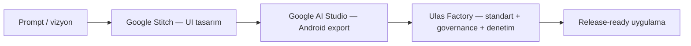

# AI Studio / Stitch → Fabrika Import

Bu belge, **Prompt → Google Stitch (tasarım) → Google AI Studio (Android export) → Fabrika (boşluk doldurma)** iş akışını tanımlar.

## Vizyon (doğru kurgu)



| Aşama | Araç | Çıktı |
|-------|------|--------|
| 1 | Prompt | Ürün vizyonu, ekran listesi |
| 2 | **Google Stitch** | Görsel/UI tasarım (manuel veya Stitch export) |
| 3 | **Google AI Studio** | Ham Android projesi (genelde tek modül, eksik standartlar) |
| 4 | **Bu fabrika** | 10 modül mimarisi, i18n, güvenlik, OEM, governance, F0–F8 |

**Fabrikanın rolü:** AI Studio çıktısını **sıfırdan yazmak değil** — mevcut kodu koruyarak **Standartlar + Executive OS + denetim** ile olgunlaştırmak.

---

## AI Studio tipik eksiklikleri (fabrikanın doldurduğu)

| Eksik | Fabrika karşılığı |
|-------|-------------------|
| Hard-coded string | `assets/locales/tr.json`, `en.json` + i18n katmanı |
| Tek modül / düz yapı | `MODULE_MAP.md` + kademeli modül ayrımı (F2–F3) |
| Güvenlik / SQLCipher / root detection | `core/security`, `docs/03-STANDARDS/SECURITY.md` |
| OEM (Samsung/MIUI) | `core/oem`, OEM matris |
| Monetizasyon / Play Integrity | `feature/premium`, standartlar |
| Governance / faz disiplini | `YAPILACAKLAR.md`, `init-governance.sh` |
| Derleme kanıtı | `gradle-build-loop.sh`, `state-recovery.sh` |
| Cursor context | `layer-NN.yaml`, `phase-agents.json` |

---

## Önerilen kurulum (tek seferlik)

AI Studio'dan indirdiğiniz proje klasörü: örn. `~/Projects/my-aistudio-app/`

### Adım 1 — Fabrikayı referans alın

Fabrika reposunu bir kez klonlayın (güncellemeler için sabit yol):

```bash
git clone https://github.com/clariongemini/Android-App.git ~/Android-App-Factory
```

### Adım 2 — Bootstrap (standartları aktar + governance + YAPILACAKLAR)

```bash
export FACTORY_REPO=~/Android-App-Factory
"$FACTORY_REPO/scripts/bootstrap-external-project.sh" \
  ~/Projects/my-aistudio-app \
  "UygulamaAdi" \
  "com.sirket.uygulama" \
  "Kısa vizyon promptu — Stitch tasarımına uygun geliştirme"
```

Bu komut:

1. `sync-standards.sh` ile `.cursor/`, `governance/`, `scripts/`, `docs/` aktarır  
2. **Mevcut `app/` ve AI Studio kaynak kodunu silmez**  
3. `init-governance.sh` + `init-yapilacaklar.sh` çalıştırır  
4. `.factory/bootstrap_manifest.json` yazar (Cursor `/baslat` kapısı)

**Fabrika doğrulama:** `./scripts/bootstrap-external-project.sh` · `./scripts/run-factory-audit.sh`

### Adım 3 — Cursor

```text
/baslat
AI Studio export'unu incele; fabrika standartlarına göre F0'dan mükemmel hale getir.
Tasarım referansı: [Stitch export / ekran görüntüleri yolu]
```

---

## Cursor'da ilk oturum (agent protokolü)

Agent **her oturumda** ( `.cursor/rules/20-aistudio-import.mdc` ):

1. `.factory/bootstrap_manifest.json` var mı?  
   - **Yoksa** → `bootstrap-external-project.sh` veya manuel sync öner; kod yazma.  
2. `YAPILACAKLAR.md` oku → aktif faz.  
3. AI Studio kodunu **refactor**, gereksiz yeniden yazma değil.  
4. F3+ Gradle değişikliği → `gradle-build-loop.sh`.

---

## Bilinçli sınırlar (yanlış beklentiler)

| İddia | Gerçek |
|-------|--------|
| "Cursor projeyi açınca otomatik script koşar" | Cursor **workspace on-load hook** sunmaz; tetikleyici **ilk chat** veya `/baslat` |
| "`sync-standards.sh .` ham projede tek başına yeter" | Önce fabrika `scripts/` kopyalanmalı veya `FACTORY_REPO` ile dış script çağrılmalı |
| "`first-setup.sh` AI Studio projesinde çalıştır" | **Yanlış** — fabrika şablon repo içindir; `bootstrap-external-project.sh` kullan |
| "Bootstrap bitene kadar hiç `.kt` dokunma" | AI Studio projesinde `.kt` **zaten var**; yasak refactor'u durdurur — **governance hazır olmadan büyük refactor yasak** |
| "Stitch API otomatik entegre" | Repoda Stitch API yok; tasarım **manuel export** (PNG/Figma/Stitch link) handoff |

---

## Stitch handoff (manuel)

MCP veya dosya handoff:

```
.cursor/snapshots/mcp/stitch-design-YYYYMMDD.json
```

İçerik: ekran listesi, renk/font token özeti, Stitch export URL veya görseller.  
Agent: `docs/03-STANDARDS/LIQUID_GLASS.md` ile hizalar.

---

## İlgili

- [`docs/BOOTSTRAP.md`](BOOTSTRAP.md) — Senaryo B (mevcut projeye aktarma)  
- [`scripts/bootstrap-external-project.sh`](../scripts/bootstrap-external-project.sh)  
- [`/import-aistudio`](../.cursor/commands/import-aistudio.md) — Cursor komutu  
- [`docs/CURSOR_TERMINAL_BRIDGE.md`](CURSOR_TERMINAL_BRIDGE.md)
